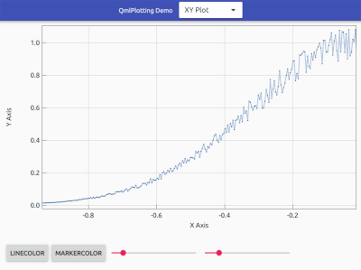
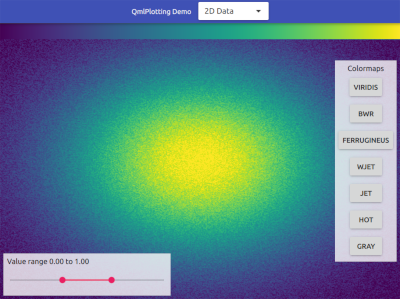
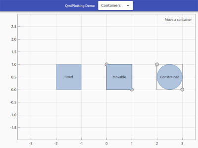

# QmlPlotting
QmlPlotting is a collection of QtQuick items for scientific data visualization bundled as QtQuick plugin.

## Building
The QmlPlotting project and build process is based on [QBS](http://doc.qt.io/qbs/). The easiest way for building the plugin and running the examples is to open and build the project with a recent version of QtCreator. The minimum requirements for building QmlPlotting are [Qt 5.9](https://www.qt.io/download/) (or later) and a compiler supporting C++14.

## Documentation
A documentation of the API does not exist yet. Until then the example application serves as a reference for using QmlPlotting in custom applications.

## License
QmlPlotting is available under the [MIT license](LICENSE).
